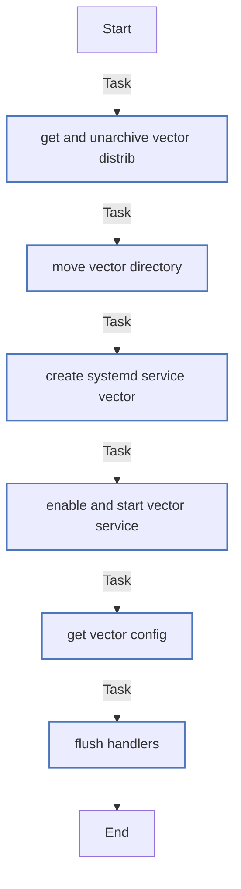

# Роль Vector (08-ansible-04-role-vector)

Описание: Роль устанавливает Vector

| Field                | Value           |
|--------------------- |-----------------|
| Readme update        | 09/02/2025 |

### Defaults: Статические переменные с низким приоритетом

#### Файл: defaults/main.yml

| Var          | Type         | Value       |Required    | Title       |
|--------------|--------------|-------------|-------------|-------------|
| [vector_version](defaults/main.yml#L2)   | str   | `0.44.0` |    n/a  |  n/a |
| [vector_clickhouse_ip](defaults/main.yml#L3)   | str   | `172.17.0.2` |    n/a  |  n/a |

### Vars: Статические переменные с высоким приоритетом

#### Файл: vars/main.yml

| Var          | Type         | Value       |Required    | Title       |
|--------------|--------------|-------------|-------------|-------------|
| [vector_platform](vars/main.yml#L2)   | str   | `x86_64` |    n/a  |  n/a |
| [vector_directory](vars/main.yml#L3)   | str   | `/opt` |    n/a  |  n/a |

### Tasks: Задания

#### File: tasks/main.yml

| Name | Module | Has Conditions |
| ---- | ------ | --------- |
| Get and Unarchive vector distrib | ansible.builtin.unarchive | False |
| Move vector directory | command | False |
| Create systemd service Vector | copy | False |
| Enable and start Vector service | systemd | False |
| Get vector config | template | False |
| Flush handlers |  | False |



## Сценарий

```yml
---
- hosts: localhost
  remote_user: root
  roles:
    - vector-role

```

## Автор

tvm2360

#### Лицензия

MIT

#### Минимальная верия ansible

2.10

#### Платформы

- **Ubuntu**: [20.04]


